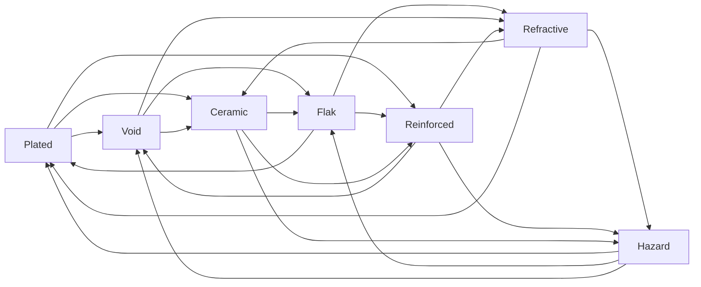

# Weapon/Armor Matchup — the 7-Type Two-Paradox System

The technical centerpiece and the primary defense against the combat-tuning risk. **Balanced by construction**, so we don't hand-author a matchup chart and pray it doesn't collapse.

Background: this is a *two-paradox tournament* (a directed Paley graph), the n=2 case of "n-paradoxical tournaments" (OEIS A362137). Standard rock-paper-scissors is the n=1 case (size 3). The n=2 case has smallest size **7**. (Source: the "Rock Paper Scissors 2" framing by Fractal Philosophy + OEIS A362137.)

## The two locked decisions

### 1. Matchups live on GEAR, not on unit types

A unit-type wheel would force 7 archetypes and collapse named gangers into "the rock guy" — destroying pillar 1 (the roster is the story). Instead:

- **Gangers are people.** Their identity comes from wounds / XP / grudges.
- **Gear carries the matchup.** A veteran can re-arm to counter the gang he has a grudge against — that's a *decision*, and decisions generate situations.

### 2. ONE shared 7-type wheel, not 7 weapons × 7 armors

Do **not** model 49 separate cells. Model **7 types** (Pokémon-style single type system):

- Each **weapon emits one type**.
- Each **armor is one type**.
- A matchup resolves through **one tournament lookup**.

Players learn **7 things and a pattern**, not 49 cells.

## The 7 types

Every type has an **armor name** and a **weapon/damage name** — different vocabulary, same wheel node (`#`). Each type is **strong vs 3, weak vs 3, and neutral vs 1** (its own mirror). The relation is **self-converse, so one wheel drives both sides**: an edge "X → Y" means your *X-type weapon* penetrates their *Y-type armor* **and** your *X-type armor* resists their *Y-type weapon*.

┌───┬────────────┬─────────────────┐
│ # │ Armor      │ Weapon / Damage │
├───┼────────────┼─────────────────┤
│ 0 │ Plated     │ Shock           │
│ 1 │ Refractive │ Blast           │
│ 2 │ Flak       │ Chem            │
│ 3 │ Void       │ Kinetic         │
│ 4 │ Hazard     │ Plasma          │
│ 5 │ Reinforced │ Rend            │
│ 6 │ Ceramic    │ Las             │
└───┴────────────┴─────────────────┘

Damage flavors: **Kinetic** (slugs / autoguns / shrapnel), **Las** (beams), **Plasma** (superheated), **Chem** (toxin / acid / gas), **Shock** (arc / EMP), **Blast** (explosives / concussion), **Rend** (chain / power edges). The stats + per-hit formula these feed into live in [weapons-and-armor.md](weapons-and-armor.md).

### Table 1 — Armor vs damage

What each armor **resists** (strong), is **penetrated by** (weak), and the one damage type it neither helps nor hurts against (**neutral**, its own mirror).

┌────────────┬──────────────────────────┬─────────────────────────┬─────────┐
│ Armor      │ Strong vs — resists      │ Weak vs — penetrated by │ Neutral │
├────────────┼──────────────────────────┼─────────────────────────┼─────────┤
│ Plated     │ Kinetic · Rend · Las     │ Blast · Chem · Plasma   │ Shock   │
│ Refractive │ Plasma · Las · Shock     │ Chem · Kinetic · Rend   │ Blast   │
│ Flak       │ Rend · Shock · Blast     │ Kinetic · Plasma · Las  │ Chem    │
│ Void       │ Las · Blast · Chem       │ Plasma · Rend · Shock   │ Kinetic │
│ Hazard     │ Shock · Chem · Kinetic   │ Rend · Las · Blast      │ Plasma  │
│ Reinforced │ Blast · Kinetic · Plasma │ Las · Shock · Chem      │ Rend    │
│ Ceramic    │ Chem · Plasma · Rend     │ Shock · Blast · Kinetic │ Las     │
└────────────┴──────────────────────────┴─────────────────────────┴─────────┘

### The wheel

Heptagon of the 7 types. An arrow **X → Y** means *X is strong vs Y* (X's weapon penetrates Y's armor; X's armor resists Y's weapon).

```text
                        ╭──────────────────────╮
                        │  0   Plated / Shock   │
                        ╰──────────────────────╯
        ╭──────────────────────╮      ╭──────────────────────╮
        │  6   Ceramic / Las    │      │ 1  Refractive / Blast │
        ╰──────────────────────╯      ╰──────────────────────╯

     ╭──────────────────────╮            ╭──────────────────────╮
     │ 5  Reinforced / Rend  │            │   2    Flak / Chem    │
     ╰──────────────────────╯            ╰──────────────────────╯
        ╭──────────────────────╮      ╭──────────────────────╮
        │  4  Hazard / Plasma   │      │  3   Void / Kinetic   │
        ╰──────────────────────╯      ╰──────────────────────╯
```

**The rule (rotationally symmetric):** type `i` is **strong vs** `i−1, i−2, i−4`; **weak vs** `i+1, i+2, i+4`; **neutral vs** itself. Equivalently, the tournament is three one-way rings (each node has exactly one out-edge per ring):

−1 ring:  Plated → Ceramic → Reinforced → Hazard → Void → Flak → Refractive → (Plated)
−2 ring:  Plated → Reinforced → Void → Refractive → Ceramic → Hazard → Flak → (Plated)
−4 ring:  Plated → Void → Ceramic → Flak → Reinforced → Refractive → Hazard → (Plated)

A Mermaid version for renderers (every arrow = *strong vs*):



## Modifier, never auto-win — locked

Favorable matchups must **not** auto-win. If they did, the whole tactical layer collapses into a pre-mission loadout puzzle ("did I bring the right gun? yes/no → fight decided").

The matchup is a **multiplier on weapon `punch` and `shred` only** (the full damage-resolution model is in [weapons-and-armor.md](weapons-and-armor.md)):

- **Favorable** (weapon type beats armor type): punch & shred **×1.33** (+33%).
- **Neutral** (same type / mirror): **×1** (unchanged).
- **Resisted** (weapon type loses): punch & shred **×0.34** (−66%).

Everything else — HP loss, wound-chance, severity, armor wear — ripples from that single hook through the damage formula, so the matchup is *felt* without ever being decisive.

**Why a multiplier:** it is **scale-independent** (correct whatever the eventual weapon/armor numbers turn out to be), so it always satisfies the two locked rules:

- **Always felt, never too small** — a proportional swing can't be drowned out by large base numbers (no "floor" problem).
- **Never auto-wins** — ×0.34 still penetrates, ×1.33 doesn't bypass armor; `effPen = max(0, punch·mult − hardness)` floors penetration naturally.
- **Asymmetric** — the resisted penalty (−66%) is **double** the favorable bonus (+33%), so players are pressured to *avoid* bad matchups, not just chase good ones.

The **±33% / 66%** magnitudes are the starting values, live as tuning data (a Bevy `Resource`; `matchup_favorable / matchup_neutral / matchup_resisted` = 1.33 / 1.0 / 0.34); final tuning is TBD.

## Why feel reads as "earned"

*"My weapon hard-counters you"* reads as cheap; *"your armor is built to shrug this off"* reads as earned. Same math, better framing. This is the Total War / Fire Emblem lesson: keep the matchup as one input among several (cover, positioning, TU, wounds) so fights stay emergent instead of deterministic.

## The math we get for free

The 7-node Paley tournament is **doubly regular with λ=1**. Type `x` is strong against `x−1`, `x−2`, `x−4` (mod 7) — i.e. `x+3, x+5, x+6`, the quadratic **non-residues** mod 7 (the converse orientation of the residue set `{1,2,4}`; same doubly-regular structure, opposite arrows). Each type beats exactly 3 and loses to exactly 3 (a balanced regular tournament — equal win rates, no dominant strategy).

Emergent properties, straight out of the structure:

- **Two enemy armor types → exactly one weapon answers both.** Not zero (always an answer), not several (the answer is specific). Tense but fair when you can carry only one weapon.
- **Three enemy armor types → no single weapon covers all of them.** Three-way coverage needs a 3-paradox tournament (minimum 19 nodes), which we don't have. So three threats *force* a loadout split or an accepted bad matchup. That escalation — *two threats = solvable, three threats = tradeoff* — is exactly the texture a situation generator wants.
- **Self-converse (symmetric).** The same guarantee runs on defense: any pair of incoming weapon types has exactly one armor that resists both.
- **7 is the floor.** You cannot drop to 5 or 6 and keep the pair-guarantee. 3 nodes is just standard RPS (the 1-paradox case).

## Drop-in data

Weapon node `w` penetrates armor nodes `w+3, w+5, w+6` (mod 7). Shipped as the matchup lookup in `crates/gdtf_battle_sim/src/damage_resolution/matchup/wheel.rs` (same table, derived — `WheelNode::strong_against` yields `w+3, w+5, w+6` mod 7 and `matchup()` resolves mirror / strong / else exactly as below):

```rust
// node = one type, dual-named:
//   0 Plated/Shock · 1 Refractive/Blast · 2 Flak/Chem · 3 Void/Kinetic
//   4 Hazard/Plasma · 5 Reinforced/Rend · 6 Ceramic/Las
// STRONG_AGAINST[w] = armor nodes that weapon node `w` PENETRATES.
// Strong vs these 3, Resisted vs the other 3, Neutral vs its own mirror (w).
const STRONG_AGAINST: [[u8; 3]; 7] = [
    [3, 5, 6], // 0 strong vs 3,5,6  (resisted by 1,2,4)
    [4, 6, 0], // 1 strong vs 4,6,0  (resisted by 2,3,5)
    [5, 0, 1], // 2 strong vs 5,0,1  (resisted by 3,4,6)
    [6, 1, 2], // 3 strong vs 6,1,2  (resisted by 4,5,0)
    [0, 2, 3], // 4 strong vs 0,2,3  (resisted by 5,6,1)
    [1, 3, 4], // 5 strong vs 1,3,4  (resisted by 6,0,2)
    [2, 4, 5], // 6 strong vs 2,4,5  (resisted by 0,1,3)
];

enum Matchup { Favorable, Neutral, Resisted }

fn matchup(weapon: u8, armor: u8) -> Matchup {
    if weapon == armor { Matchup::Neutral }
    else if STRONG_AGAINST[weapon as usize].contains(&armor) { Matchup::Favorable }
    else { Matchup::Resisted }
}
```

Unit tests pin the wheel (the matchup module's `#[cfg(test)] mod test`, `crates/gdtf_battle_sim/src/damage_resolution/matchup/test.rs`): each type beats exactly 3 / loses to 3 (`each_type_favorable_three_resisted_three`), and the tournament antisymmetry (one node's favorable is the other's resisted — `favorable_implies_mirror_resisted`). The λ=1 pair-guarantee assert (every pair of armor types has exactly one weapon strong against both) is still an open test target.

## UI requirement — non-negotiable

**Surface the matchup in the targeting UI.** Show favorable / neutral / resisted (green / grey / red) on the reticle when the player picks a target. **TBD (Bevy):** the targeting reticle tints by matchup and the aim line names it (the battle presenter, `crates/gdtf_battle_presenter`; reads the worn torso piece — broken armor reads neutral, no matchup to promise). Nobody memorizes a 7-node Paley wheel — they read the reticle and learn the pattern through play. Dedicated matchup icons (e.g. game-icons.net) are still open.
